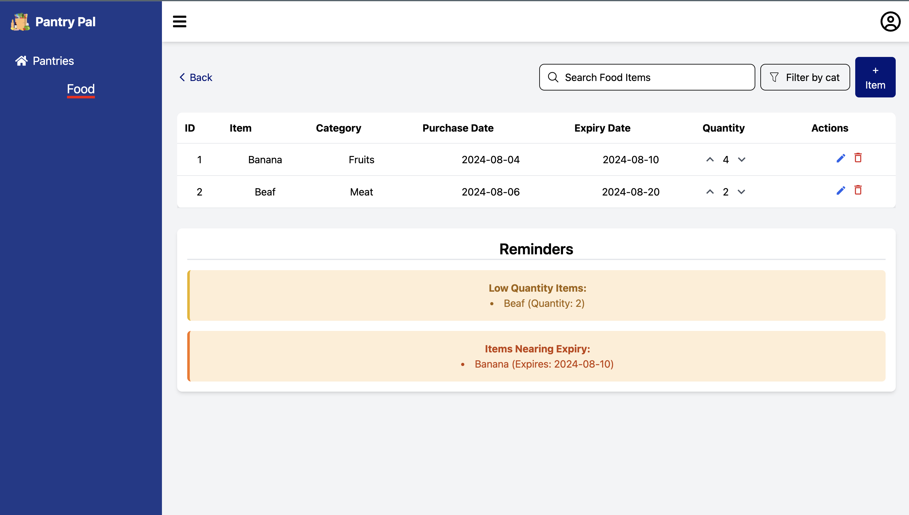

# PantryPal

#### Author: Emmanuel Kasuti Makau
#### Date: July 31, 2024
#### Purpose: PantryPal ReadMe

## Purpose
PantryPal is a web application designed to help users manage their pantry inventory efficiently. It allows users to track food items, their expiration dates, and quantities, helping to reduce food waste and streamline grocery shopping.

## Features
- User authentication and account management
- Create and manage multiple pantries
- Add, edit, and remove food items
- Track expiration dates and receive notifications
- Search and filter pantry items
- Generate shopping lists based on low stock items
- Mobile-responsive design for on-the-go access

## Technologies Used
- Frontend: React.js, Tailwind CSS
- Backend: Node.js, Express.js
- Database: Firebase
- Authentication: Firebase Authentication
- Icons: React Icons

## Installation
1. Clone the repository:
   ```
   git clone https://github.com/EKasuti/pantryPal.git
   ```
   
2. Install dependencies for both frontend and backend:
   ```
   cd frontend && npm install
   cd ../backend && npm install
   ```
3. Set up environment variables:
   - Create a `.env` file in the backend directory
   - Add necessary environment variables (FIREBASE_PROJECT_ID, FIREBASE_PRIVATE_KEY, FIREBASE_PRIVATE_KEY_ID, FIREBASE_CLIENT_EMAIL, FIREBASE_CLIENT_ID )

5. Start the development servers:
   ```
   # In the backend directory
   node src/server.js

   # In the frontend directory
   npm start  [or] npm run dev
   ```

## Usage
1. Register for an account or log in if you already have one.
2. Create a new pantry or select an existing one.
3. Add items to your pantry, including name, quantity, and expiration date.
4. Use the search and filter functions to find specific items.
5. Update quantities or remove items as you use them.
6. Check the shopping list feature for items running low.

## Contributing
Contributions to PantryPal are welcome! Please follow these steps:
1. Fork the repository
2. Create a new branch: `git checkout -b feature-branch-name`
3. Make your changes and commit them: `git commit -m 'Add some feature'`
4. Push to the branch: `git push origin feature-branch-name`
5. Submit a pull request

## License
This project is licensed under the MIT License - see the [LICENSE.md](LICENSE.md) file for details.

## Contact
Emmanuel Kasuti Makau - [emmanuel.k.makau.jr.26@dartmouth.edu](mailto:emmanuel.k.makau.jr.26@dartmouth.edu)

Project Link: [https://github.com/EKasuti/pantryPal](https://github.com/EKasuti/pantryPal)

Deployed Link: [https://pantry-pal-sooty.vercel.app](https://pantry-pal-sooty.vercel.app/)

## Acknowledgments
- [React.js](https://reactjs.org/)
- [Node.js](https://nodejs.org/)
- [Express.js](https://expressjs.com/)
- [Firebase](https://firebase.google.com/)
- [Tailwind CSS](https://tailwindcss.com/)
- [React Icons](https://react-icons.github.io/react-icons/)


## Images
Landing Page: 
Dashboard: 
Pantry List: 

## Video
I created a youtube video to showcase the features of PantryPal. You can find youtube link [here](https://youtu.be/7p3-sK9vLvE).